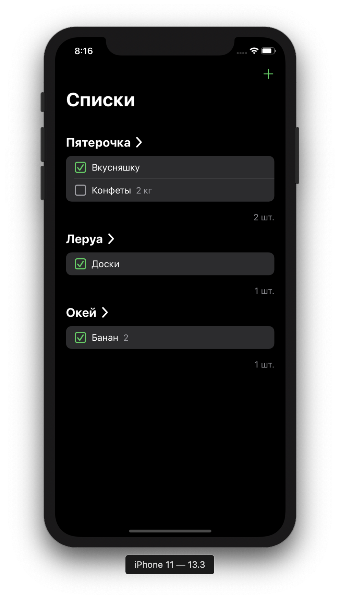
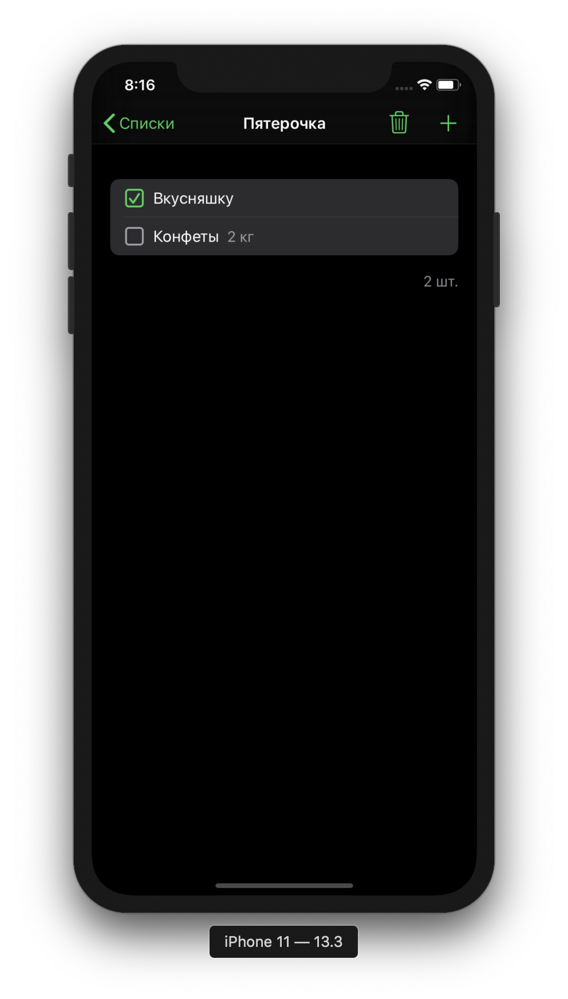
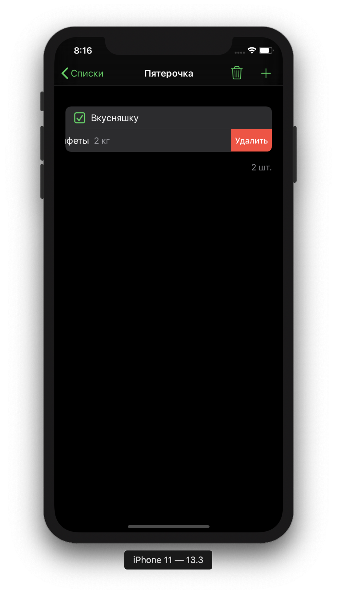

# Список покупок

## Задание

Необходимо реализовать «координатор покупок», в котором предусмотреть возможности создания списка покупок, управление им (добавление, удаление и вычеркивание купленных товаров)

## Используемые библиотеки

- `SwiftGen` - для кодогенерации ассетов
- `SwiftLint` - линтер
- `BulletinBoard` - библиотека для показа красивых модальных экранов
- `ReactiveDataDisplayManager` - библиотека для работы с коллекциями данных
- `SurfUtils/StringAttributes` - утилита для работы с `NSAttributedString`
- `SurfUtils/LocalStorage` - утилита для сохранения/чтения файла из файловой системы устройства

## Технические детали

- Сохранение данных происходит в файл. Для этого сущности, которые необходимо сохранять удовлетворяют протоколу `Codable`. Чтение происходит таким же образом.
- Для перехода между экранами используется `Router`
- Сервисы для получения/сохранения списков покупок имеют делегаты, которым они сообщают обо всех изменениях. Это позволяет синхронизировать данные на смежных экранах между собой
- Для ввода данных используется экран, сгенерированный библиотекой `BulletinBoard` - `BLTNPageInput`
- Использовано несколько функциональных операторов, облегчающих повседневную работу с кодом:
  - аналог `apply` - `~~>`
  - аналог `let` - `~>`
  - облегчение работы с `[weak self]` конструкцией - `weak(self) { $0... }`
- Использовано множество `extension`-ов, которые так же облегчают работу
- Поддерживаются темная и светлая темы

## Скриншоты

## Дизайн

[Design by Judah Guttmann](https://dribbble.com/shots/4299854-Sneak-Peek-Simple-to-To-Do-List-App)
